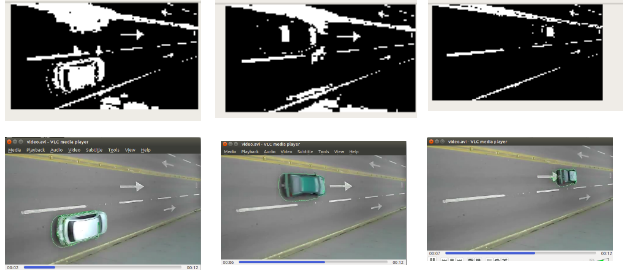

# Real Time Visual Tracking- Using Gaussian Mixture Model


### Requirements :
* python >= 3.6.8
* numpy >= 1.15.4
* cv2 >= 4.1.1


### Usage

#### To test the system and get the accuracy
```
python main.py

Hyperparameter : 
train_frame_cnt  = 50
K = 4
alpha = 0.05
T_b = 0.90
threshVar=2.5
```

#### Model API 
```
 
gmm = GMM(K, alpha, T_b, threshVar)
#train
gmm.perform(PATH, train_frame_cnt, task = "train")
#test
gmm.perform(PATH_test, train_frame_cnt, task="test")
```

### Results



### Usefull Links :
* https://www.youtube.com/watch?v=g_ve2txPkSc
* http://www.ai.mit.edu/projects/vsam/Publications/stauffer_cvpr98_track.pdf
* https://ieeexplore.ieee.org/abstract/document/784637
